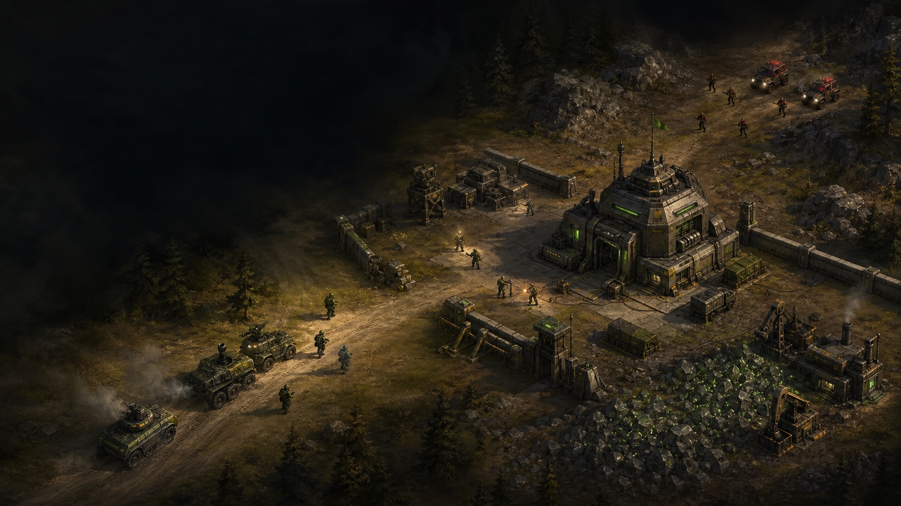

# Iron Doctrine



> **In active development.** Iron Doctrine is playable, but its balance, content and
> presentation are still evolving.

Iron Doctrine is an original browser real-time strategy game about commanding a small
force, recovering a foothold and turning it into a war machine. Explore through the fog
of war, secure resources, build a defended base and make readable tactical decisions
under pressure.

The project takes inspiration from the clarity and physical command interfaces of
classic RTS games while building its own world, units and visual identity.

## Play the current build

Requires Node.js 20+ and pnpm.

```bash
pnpm install
pnpm --filter @iron/client dev
```

Open [localhost:5173](http://localhost:5173), configure a skirmish and deploy.

The opening scenario starts with a capable patrol searching for an abandoned command
base. Recover it, establish an economy and prepare before hostile forces mobilize.

## Current state

- Deterministic real-time simulation with seeded randomness and fixed-point math
- First Contact opening, fog of war and guided mission objectives
- Base construction, power, harvesting and production
- Infantry, vehicles, defensive turrets and enemy AI
- Contextual orders, tactical radar and mouse-driven battlefield navigation
- Local map catalog, validated JSON import/export and full-screen Map Forge
- Save/load, deterministic replays and a multiplayer server foundation
- Original industrial interface, effects and synthesized audio

This is a real playable vertical slice, not a finished game. The technical foundation is
stable; game feel, balance, animation, art and scenario content remain active work.

## Controls

| Input                        | Action                                    |
| ---------------------------- | ----------------------------------------- |
| Left click                   | Select a unit or structure                |
| Left drag                    | Box-select a squad                        |
| Right click                  | Move, attack, gather or set a rally point |
| Mouse wheel                  | Zoom                                      |
| Screen edge / WASD / arrows  | Move the camera                           |
| Middle or right drag         | Drag the camera                           |
| Double left click on terrain | Center the view                           |

The in-game Setup panel contains the complete control reference, mission status and
audio settings.

## Contributing

Contributions are welcome. Useful ways to help include:

- playtesting and reporting the first moment that feels unclear or unfair;
- sharing maps created with Map Forge;
- proposing balance changes with a reproducible scenario;
- submitting focused, tested code changes;
- contributing original art, animation, sound or music.

Before starting a large change, open a discussion so the direction stays coherent.
Small, reviewable pull requests are preferred over broad rewrites.

If you like the direction of the project, a **GitHub star** helps other RTS players and
contributors discover it.

## Development

```bash
pnpm test
pnpm typecheck
pnpm lint
pnpm build
```

```text
packages/shared   Shared formats and network contracts
packages/engine   Deterministic headless game simulation
apps/client       React, PixiJS and the simulation worker
apps/server       Multiplayer match-host foundation
docker            Reproducible local and production containers
docs              Architecture and design documentation
```

Every change is expected to keep tests, strict type checking, linting and the production
build green. Architectural decisions and longer-term milestones live in the
[software design document](docs/SOFTWARE_DESIGN_DOCUMENT.md).

## Intellectual property

Iron Doctrine is original work. Its names, factions, artwork and audio are original;
its influences are limited to established real-time strategy conventions and
game-design principles.
