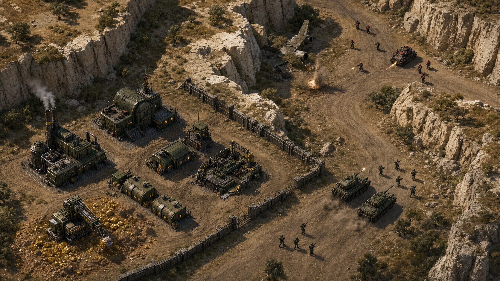

# Iron Doctrine Art Direction

## Purpose

This document defines the production visual target for Iron Doctrine. It is a gate, not a mood
board: new gameplay scope remains frozen until one representative Iron Pass encounter reaches
this bar at normal gameplay zoom.

The target is an original, authored 2.5D military RTS. It should feel materially grounded and
immediately readable, with the deliberate density of a miniature battlefield rather than the
flat abstraction of a prototype.



The generated concept is directional reference only. It must not be shipped as a runtime asset or
treated as exact geometry. Runtime art must be built as original, controllable source assets.

## Design thesis

**A sun-bleached Mediterranean war machine crossing terrain that remembers previous battles.**

The world combines:

- heavy industrial equipment designed to be repaired in the field;
- pale limestone, dry soil and sparse olive scrub;
- compact, directional shadows that preserve tactical information;
- restrained faction markings applied to material forms, never replacing silhouette;
- evidence of logistics and prior combat without filling every traversable lane.

The memorable signature is the contrast between warm limestone terrain and dark, worn military
machinery. Neon science fiction, toy-like proportions and cinematic darkness are outside the
target.

## Core palette

| Role                   | Name                | Hex       |
| ---------------------- | ------------------- | --------- |
| Terrain foundation     | Iron Pass limestone | `#8F856C` |
| Traversable soil       | Campaign dust       | `#756448` |
| Directive armor        | Field olive         | `#394338` |
| Deep metal and outline | Charcoal steel      | `#171C19` |
| Faction identification | Directive red       | `#8F3429` |
| Functional feedback    | Service amber       | `#E0B34B` |

Colors are starting points, not flat fills. Every authored material needs a shadow, base, light
and worn-edge response. Faction colors occupy small, repeated surfaces; they do not tint entire
units.

## Camera, scale and lighting

- Gameplay uses a three-quarter top-down camera around 55–60 degrees.
- Assets share one ground plane and one scale reference. Doors, infantry, vehicles and walls must
  remain proportionally credible together.
- Sunlight comes from the upper left; cast shadows fall down-right.
- Shadows stay compact enough to avoid implying collision beyond the authoritative footprint.
- Midtones remain visible under explored fog. Pure black is reserved for hidden terrain and the
  deepest mechanical gaps.
- No depth-of-field, bloom haze or cinematic grading may reduce normal-zoom readability.

## Readability hierarchy

At normal gameplay zoom the player must recognize, in order:

1. ownership and hostility;
2. unit class and facing;
3. traversable versus impassable terrain;
4. weapon fire, damage and active orders;
5. material and surface detail.

Detail that harms an earlier item is removed. Each silhouette is tested first in flat charcoal,
then with material, and finally under fog.

## Units

### Vehicles

- Tanks use a low, wide tracked silhouette with a clearly separate turret and barrel.
- Scouts use exposed wheels, a lighter cabin and a forward-biased profile.
- Harvesters use a visible collection head and open ore storage; cargo state must read without
  relying on UI.
- Vehicle source art targets 16 facings. Rotation must not blur or visibly distort the hull.
- Required states: idle, moving, firing/recoil, damaged and destroyed.
- Tracks, wheels, exhaust and dust provide motion. The whole body must not wobble.

### Infantry

- Infantry source art targets eight facings.
- Rifleman, Engineer and Medic differ through silhouette and equipment before color:
  rifle length, tool pack and medical bag.
- Required states: idle, move, action/fire, hit reaction and death.
- Animation favors strong poses and held frames over excessive frame count.
- Helmets, shoulders and equipment may be exaggerated slightly for gameplay scale; heads and
  hands may not become cartoonishly large.

## Buildings

- Every building communicates function through massing: production openings, power exhaust,
  service cranes and defensive traverse.
- Concrete foundations visibly disturb the underlying ground.
- Required states: foundation, construction, operational, damaged and destroyed.
- Mechanical activity is localized: vents, doors, lamps, cranes and conveyors.
- Roof detail is simplified around the silhouette edge so buildings remain identifiable under
  selection outlines and fog.

## Terrain and resources

- Terrain uses authored modular surfaces plus decals, not a visible grid of independent squares.
- Roads follow strategic movement and connect bases, resource sites and chokepoints.
- Limestone formations use large connected masses; scattered small rocks never imply false
  collision.
- Traversable ground keeps visual breathing room around units and command targets.
- Ore is embedded in disturbed soil. Its warm metallic reflection distinguishes it from generic
  yellow paint or a glowing pool.
- Wreckage, bones and casings tell local stories but remain subordinate to navigation.

## Effects

- Muzzle flashes are brief and weapon-specific.
- Hits distinguish dust, sparks and armor impact.
- Explosions have flash, debris, smoke and residue phases.
- Smoke expands and loses contrast over time; it must not become an opaque tactical curtain.
- Persistent scorch and track decals are bounded and presentation-only.
- Screen shake is reserved for nearby heavy impacts and must respect reduced-motion settings.

## Interface

- Preserve the centered, compact 1990s command-console structure.
- Replace text abbreviations and procedural silhouettes with original production icons derived
  from final unit art.
- UI materials remain quieter than the battlefield. The interface frames information rather than
  competing with combat.
- Selected, disabled, queued and unavailable states must be recognizable without color alone.

## Audio relationship

Visual weight and audio weight must agree. Heavy vehicles need low mechanical transients; rifles,
cannons, construction and ore collection need distinct original recordings. Synthetic speech
remains disabled. Recorded voice performances return only when direction, casting and processing
can produce a consistent radio language.

## Production pipeline

1. Create editable source art under `assets-src/`.
2. Export runtime sprites to deterministic texture atlases.
3. Generate a typed manifest consumed by Pixi.
4. Keep the procedural painters as temporary fallbacks until each asset family is complete.
5. Compare the runtime Iron Pass scene against this target at normal and minimum zoom.
6. Profile frame time, GPU memory and bundle impact before expanding to every map.

Generated concepts may guide source production but are never copied directly into runtime atlases.
All shipped imagery, animation and audio must remain original and reviewable.

### Battle Tank authoring

The first vehicle source is `assets-src/vehicles/tank/tank.blend`. Rebuild its checked-in 16-facing
source sheet with Blender 5.2 LTS:

```sh
blender --background --python scripts/blender/render-battle-tank.py -- \
  --blend assets-src/vehicles/tank/tank.blend \
  --frames-dir /tmp/iron-doctrine-tank-frames
node scripts/blender/compose-battle-tank.mjs \
  /tmp/iron-doctrine-tank-frames assets-src/vehicles/tank/tank.png
pnpm assets:build
```

The render script owns camera, lighting, palette and direction order. Editing the model is expected;
manually repainting individual direction frames is not, because it would break cross-frame
consistency and reproducibility.

## Iron Pass acceptance gate

The vertical slice passes only when:

- Tank, Scout, Harvester, Rifleman, Engineer and Medic are recognizable without selection UI.
- Construction Yard, Power Plant, Barracks and Factory are recognizable from silhouette.
- One base, one ore field, one rock chokepoint and one active firefight share a coherent scale.
- Traversable lanes and blocked cliffs remain obvious at normal and minimum zoom.
- Explored fog preserves terrain and unit readability.
- No runtime asset looks like an untextured primitive, floating decoration or generated mockup.
- A representative combat view holds 60 FPS within the existing render budget.
- Browser screenshots at common desktop resolutions are reviewed beside the concept target.

Only after this gate passes should the art language expand across the campaign. New gameplay and
public 1v1 work resume after the vertical slice is accepted.
