# Software Design Document — Project "Iron Doctrine"

> Browser-based, real-time strategy engine inspired by classic Command & Conquer gameplay.
> Original code and assets only. No copyrighted names, factions, artwork or audio.

- **Status:** Draft v1.0 — architecture baseline
- **Owner:** alBz
- **Stack:** TypeScript (strict) · React · PixiJS · Vite · Zustand · Web Workers · WebSocket · Node.js · Docker
- **Paradigm:** Clean Architecture + ECS + deterministic fixed-step simulation

---

## Table of Contents

1. [Goals & Non-Goals](#1-goals--non-goals)
2. [Architectural Principles](#2-architectural-principles)
3. [High-Level Architecture](#3-high-level-architecture)
4. [Layer Boundaries (Clean Architecture)](#4-layer-boundaries-clean-architecture)
5. [Monorepo & Folder Structure](#5-monorepo--folder-structure)
6. [ECS Design](#6-ecs-design)
7. [Entity Diagrams](#7-entity-diagrams)
8. [Game Loop, Simulation Tick & Rendering Loop](#8-game-loop-simulation-tick--rendering-loop)
9. [State Diagrams](#9-state-diagrams)
10. [Data Flow](#10-data-flow)
11. [Network Flow & Multiplayer Model](#11-network-flow--multiplayer-model)
12. [Pathfinding & Movement](#12-pathfinding--movement)
13. [Fog of War](#13-fog-of-war)
14. [Subsystem Catalogue](#14-subsystem-catalogue)
15. [Performance Strategy](#15-performance-strategy)
16. [Save Format](#16-save-format)
17. [Replay Format](#17-replay-format)
18. [Asset Pipeline](#18-asset-pipeline)
19. [Deployment Pipeline](#19-deployment-pipeline)
20. [Testing Strategy](#20-testing-strategy)
21. [Future Scalability](#21-future-scalability)
22. [Implementation Roadmap](#22-implementation-roadmap)

---

## 1. Goals & Non-Goals

### Goals

- Deterministic, lockstep-capable simulation runnable identically on client and server.
- Hard separation of **simulation**, **rendering**, **networking**, **state/UI**.
- Data-driven content: units, buildings, weapons, tech defined in JSON, validated by schema.
- 60 FPS with thousands of units via spatial partitioning, pooling, culling, LOD.
- Multiplayer-ready from day one (architecture), single-player + skirmish AI first.
- Every subsystem independently testable in headless mode (no DOM, no GPU).

### Non-Goals (v1)

- No copyrighted IP. Original factions ("Directive" vs "Coalition"), original art/audio.
- No matchmaking service / accounts in v1 (server is authoritative match host only).
- No mobile-first UI in v1 (desktop pointer + keyboard primary).

---

## 2. Architectural Principles

- **Determinism is the contract.** The simulation is a pure function `(State, Commands) → State'`. No `Date.now()`, no `Math.random()` inside sim — only an injected seeded PRNG and a tick counter. No floating-point nondeterminism: fixed-point math (`Q16.16` integers) for all sim-critical values (positions, velocities, health).
- **Simulation never imports rendering.** Render reads an immutable snapshot; it never mutates sim state.
- **Commands, not state, cross the wire.** Multiplayer synchronizes _intents_ (commands) under lockstep, not entity positions.
- **ECS is data + behavior separation.** Components are plain data (SoA-friendly). Systems are stateless functions over component stores.
- **Clean Architecture dependency rule.** Dependencies point inward: `domain` ← `application` ← `infrastructure`/`presentation`. Inner layers know nothing of Pixi, React, WebSocket.
- **SOLID / DRY / small modules.** No file > ~300 LOC; one responsibility per module; features behind interfaces.

---

## 3. High-Level Architecture

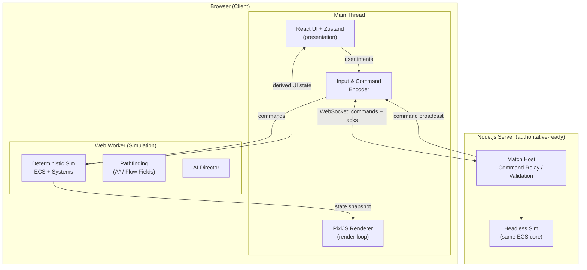

**Key split:** the heavy ECS simulation runs in a **Web Worker**, communicating with the main thread via a typed, transferable message protocol (ring buffers / `SharedArrayBuffer` where available, structured-clone fallback). The main thread only renders and captures input. The same sim core compiles for Node.js (server) with zero rendering deps.

---

## 4. Layer Boundaries (Clean Architecture)

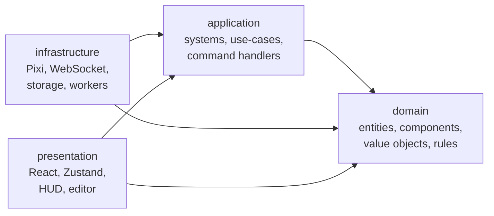

- **domain** (`packages/engine/src/domain`): pure TS. Components, entity archetypes, combat/economy rules, fixed-point math, seeded PRNG. Zero external deps.
- **application** (`.../application`): ECS World, systems, scheduler, command bus, use-cases (train unit, place building). Depends only on domain + interfaces (ports).
- **infrastructure** (`.../infrastructure`, `apps/client/src/infra`): adapters — Pixi renderer, WebSocket transport, IndexedDB save store, worker bridge. Implements ports defined in application.
- **presentation** (`apps/client/src/ui`): React + Zustand HUD, minimap, menus, map editor.

Ports (interfaces) live in `application`; adapters in `infrastructure`. Example ports: `Renderer`, `Transport`, `SaveStore`, `Clock`, `Random`.

---

## 5. Monorepo & Folder Structure

pnpm workspaces. Three publishable-shape packages + two apps.

```
command-and-conquere/
├─ pnpm-workspace.yaml
├─ package.json                 # root scripts, shared devDeps
├─ tsconfig.base.json           # strict, project references
├─ .eslintrc.cjs · .prettierrc
├─ docker/
│  ├─ Dockerfile.client
│  ├─ Dockerfile.server
│  └─ docker-compose.yml
├─ docs/
│  └─ SOFTWARE_DESIGN_DOCUMENT.md
│
├─ packages/
│  ├─ shared/                   # cross-cutting, no engine logic
│  │  └─ src/{protocol,schema,math,types,constants}
│  │
│  └─ engine/                   # THE simulation core (headless, deterministic)
│     └─ src/
│        ├─ domain/
│        │  ├─ math/            # fixed-point (Q16.16), vec2, rng (xorshift)
│        │  ├─ components/      # Position, Velocity, Health, Weapon, ...
│        │  ├─ archetypes/      # unit/building factory definitions
│        │  └─ rules/           # combat, armor tables, economy formulas
│        ├─ application/
│        │  ├─ ecs/             # World, EntityManager, ComponentStore, Query, Scheduler
│        │  ├─ systems/         # Movement, Combat, Production, Resource, Vision, AI...
│        │  ├─ commands/        # Command types + CommandBus + handlers
│        │  ├─ pathfinding/     # A*, FlowField, NavGrid, PathSmoother
│        │  ├─ ai/              # Director, behaviors, difficulty
│        │  ├─ fog/             # visibility computation
│        │  └─ ports/           # Clock, Random, Snapshot interfaces
│        └─ index.ts            # public engine API (createWorld, step, snapshot)
│
├─ apps/
│  ├─ client/                   # browser app
│  │  └─ src/
│  │     ├─ main.tsx · App.tsx
│  │     ├─ infra/
│  │     │  ├─ render/          # Pixi stage, layers, sprites, camera, pooling
│  │     │  ├─ worker/          # sim worker bridge (main ↔ worker protocol)
│  │     │  ├─ net/             # WebSocket transport adapter
│  │     │  ├─ storage/         # IndexedDB save/replay store
│  │     │  ├─ audio/           # Howler/WebAudio spatial audio
│  │     │  └─ input/           # pointer/keyboard → command intents
│  │     ├─ ui/                 # React HUD, minimap, queues, menus, notifications
│  │     ├─ editor/             # map editor
│  │     └─ state/              # Zustand stores (UI-only state)
│  │  └─ sim.worker.ts          # worker entrypoint importing @engine
│  │
│  └─ server/                   # Node.js authoritative match host
│     └─ src/{index,match,transport,validation}
│
├─ content/                     # data-driven game content (JSON + schema)
│  ├─ units/*.json · buildings/*.json · weapons/*.json · tech/*.json
│  └─ maps/*.json
│
└─ tests/                       # cross-package integration + determinism harness
```

**Dependency graph:** `engine` depends on `shared`. `client` and `server` depend on `engine` + `shared`. Nothing depends on `client`. Enforced via TS project references + ESLint `no-restricted-imports`.

---

## 6. ECS Design

### Storage model

- **Archetype-free, sparse-set component stores** (SoA): each component type owns a `Map<EntityId, index>` + packed typed arrays. Fast iteration, cache-friendly, cheap add/remove.
- **EntityId** = 32-bit: `index (20 bits) | generation (12 bits)` to detect stale references safely.
- **Queries** cache the set of matching entities and invalidate on structural change (add/remove component).

### Component list (data only)

`Position` · `Velocity` · `Facing` · `Health` · `Armor` · `Weapon` · `Selection` · `Movement` · `PathRequest` · `Attack` · `Animation` · `Sprite` · `Production` · `BuildQueue` · `Vision` · `Inventory` · `ResourceCarrier` · `Construction` · `Energy` · `Owner(playerId)` · `Team` · `Collider` · `Ability` · `AIControlled` · `RallyPoint`.

### System list & fixed execution order (per tick)

```
1. CommandSystem        (apply queued player/AI commands to intent components)
2. AISystem             (produce commands for AI players)
3. PathfindingSystem    (resolve PathRequest → path)
4. MovementSystem       (integrate velocity, formation, obstacle avoidance)
5. CollisionSystem      (spatial hash resolve, steering)
6. CombatSystem         (target acquisition, attack cooldowns, damage intents)
7. ProjectileSystem     (spawn/advance projectiles, impact)
8. ResourceSystem       (gather, deposit, credit accounting)
9. ProductionSystem     (build queues, construction progress)
10. EnergySystem        (power balance → enable/disable defenses)
11. VisionSystem        (recompute vision sources)
12. FogOfWarSystem      (update explored/visible grids)
13. HealthSystem        (apply damage, deaths, cleanup, spawn wreckage)
14. AnimationSystem     (advance animation state — sim-authoritative frames)
```

Rendering, audio, and input are **not** systems inside the sim tick — they live on the main thread and consume snapshots.

**Determinism rules for systems:** iterate entities in stable EntityId order; no wall-clock; all randomness via injected `Random` port seeded per match; fixed-point arithmetic for anything that affects state.

---

## 7. Entity Diagrams

### Component composition per archetype

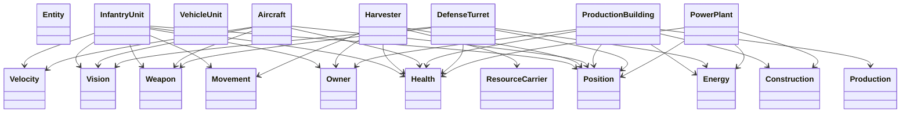

### High-level match model

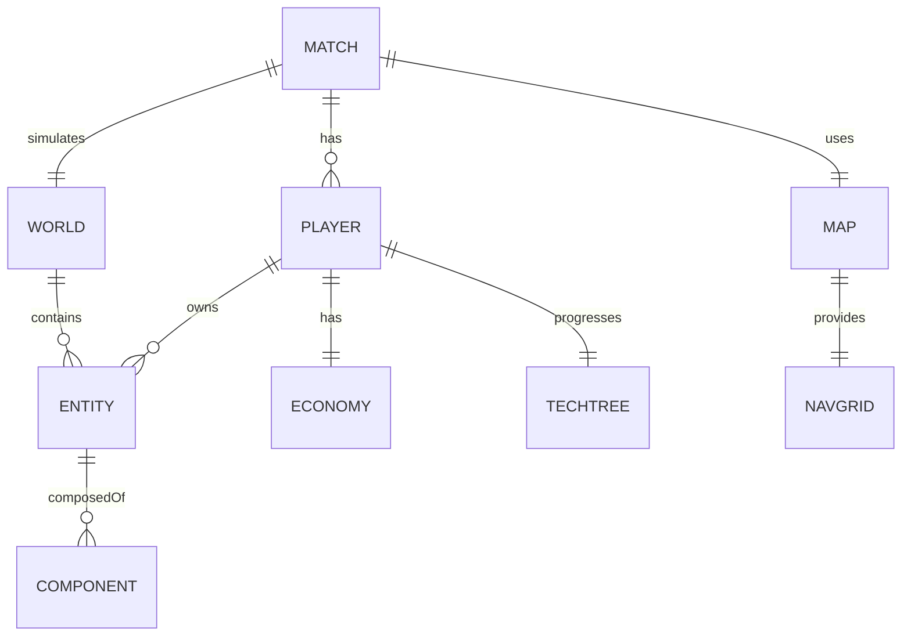

---

## 8. Game Loop, Simulation Tick & Rendering Loop

Two decoupled clocks: a **fixed-step simulation** in the worker and a **variable-rate render** on the main thread with interpolation.

### Simulation tick (worker) — fixed timestep

- Tick rate: **20 Hz** (`SIM_DT = 50ms`) for RTS (network-friendly). Configurable.
- Accumulator pattern; catches up multiple ticks if behind, capped to avoid spiral of death.

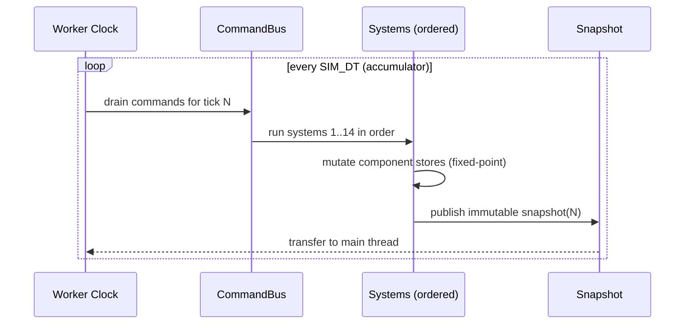

### Rendering loop (main thread) — `requestAnimationFrame`

- Reads latest two snapshots and **interpolates** entity transforms by `alpha = timeSinceLastTick / SIM_DT`.
- Never blocks on the worker; if a snapshot is late, keeps extrapolating within a bound.

```
rAF(now):
  alpha = clamp((now - lastSnapshotTime) / SIM_DT, 0, 1)
  for each visible sprite:
     render.position = lerp(prev.pos, curr.pos, alpha)
     render.rotation = angleLerp(prev.rot, curr.rot, alpha)
  cull offscreen · apply LOD · draw dirty layers · draw fog · draw HUD
```

**Why decoupled:** sim determinism requires fixed dt; rendering must be smooth at display refresh. Interpolation bridges 20 Hz sim to 60–144 Hz display.

---

## 9. State Diagrams

### Unit command/behavior state

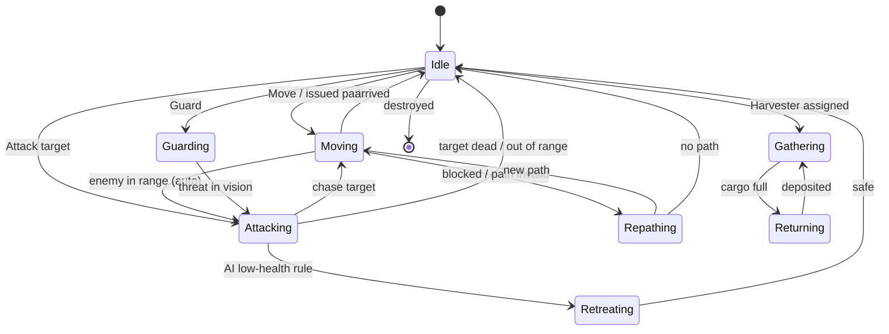

### Building lifecycle

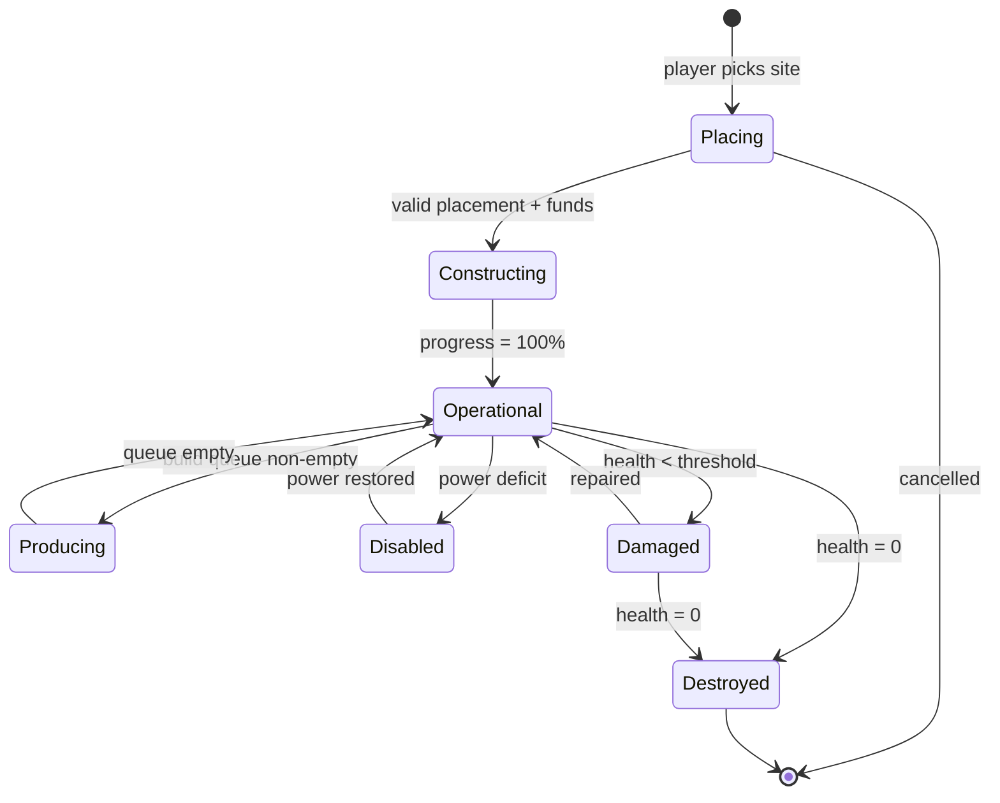

### Match lifecycle

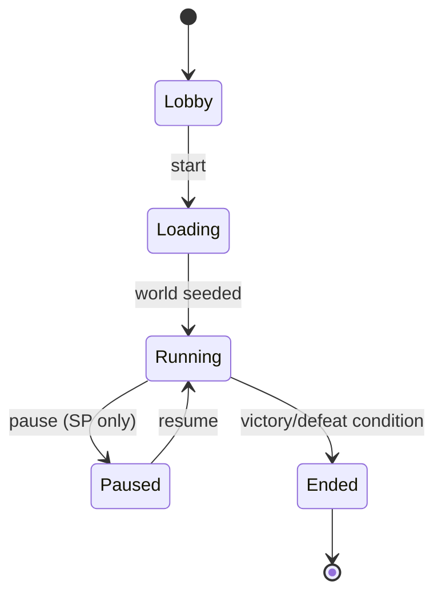

---

## 10. Data Flow

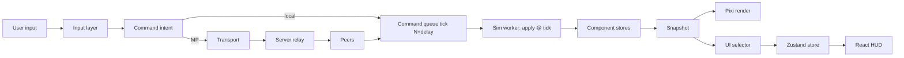

- **UI state vs sim state are separate.** Zustand holds _only_ presentation state (open panels, hovered card, camera). Authoritative game state lives in the sim; the HUD subscribes to a throttled, derived view of the snapshot (selection summary, resources, power) — never mutates it.
- **Commands are the only write path** into the simulation.

---

## 11. Network Flow & Multiplayer Model

### Model: Deterministic Lockstep with authoritative relay (v1)

- Clients exchange **commands**, not state. Each command is tagged with an **execution tick** = `currentTick + inputDelay` (e.g. +4 ticks / 200ms).
- Server validates ownership/legality, timestamps to a tick, and **broadcasts** the confirmed command set. A tick only executes once all players' command sets (or empty confirmations) for that tick are present.
- Determinism guarantees identical state on every peer → no state replication needed → tiny bandwidth (KB/min).

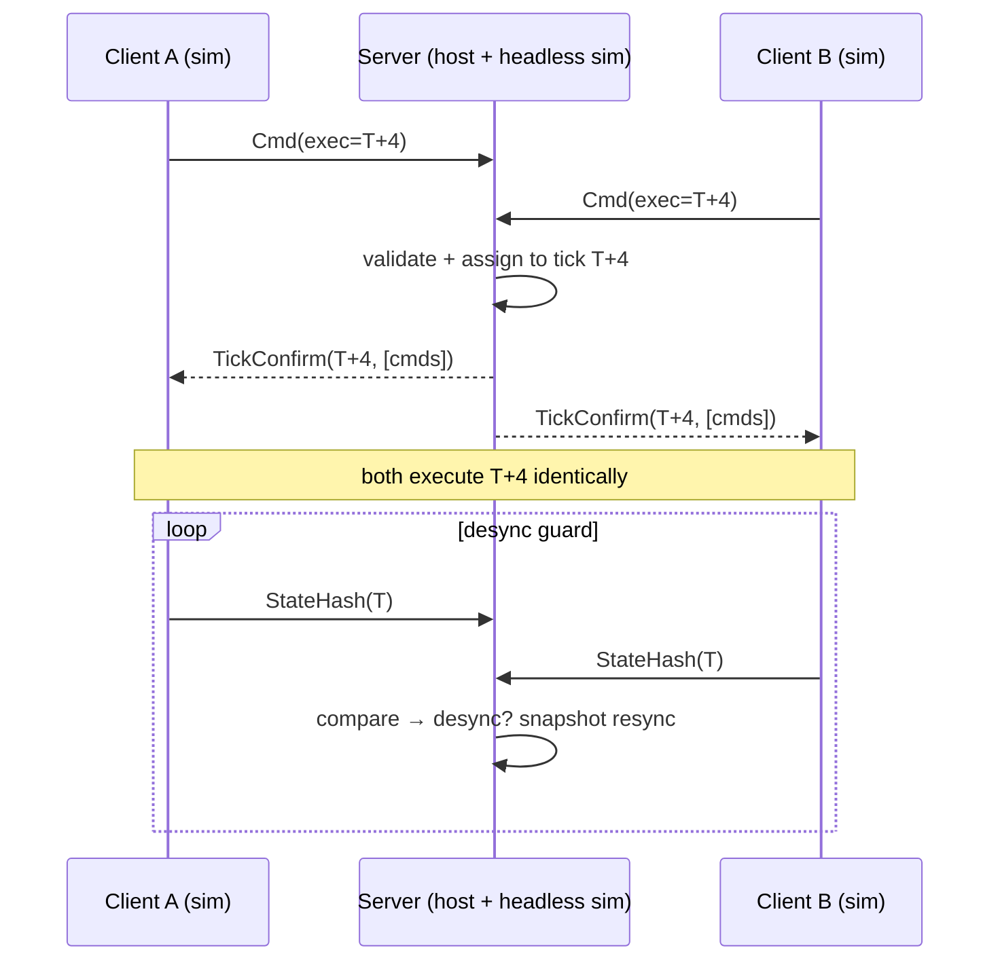

### Roadmap beyond v1

- **Authoritative server + client prediction** (for higher player counts / anti-cheat): server holds the canonical sim; clients predict locally and reconcile on divergence. The clean sim/render/net split makes this a transport swap, not a rewrite.
- **State synchronization** fallback: periodic full/delta snapshots for late-join and desync recovery.
- **Replay** = seed + full command log (see §17); replays are just a transport that feeds recorded commands.

**Protocol** (`packages/shared/src/protocol`): versioned, binary-friendly message envelope `{v, type, tick, payload}`; message types: `Join`, `Start`, `Command`, `TickConfirm`, `StateHash`, `Resync`, `Chat`, `Leave`.

---

## 12. Pathfinding & Movement

- **NavGrid:** map tiled into a passability grid (per-cell cost, blockers, footprints of buildings). Dynamic updates when buildings placed/destroyed.
- **A\*** for single-unit / point-to-point requests (binary heap, jump-point optimization on uniform grids).
- **Flow Fields** for large groups moving to a shared goal: one integration field per goal, O(cells) once, shared by hundreds of units → avoids N× A*.
- **Path smoothing:** string-pulling / funnel algorithm to remove grid staircasing.
- **Local avoidance:** RVO-lite / steering (`MovementSystem` + `CollisionSystem` with spatial hash) for unit-vs-unit dynamic avoidance and formation keeping.
- **Formations:** group commands compute per-unit offset slots around the group centroid; slots assigned by Hungarian-lite nearest matching.
- **Repathing:** on blocked path or nav change, `PathRequest` re-enqueued; throttled per unit to bound cost.

Pathfinding runs inside the sim worker (deterministic). Heavy batch requests can be offloaded to a dedicated pathfinding worker pool later without breaking determinism (results applied on a known tick).

---

## 13. Fog of War

Three-state per cell, per team: `Hidden` (0) · `Explored` (1, remembered terrain, no live units) · `Visible` (2).

- `VisionSystem` collects vision sources (`Vision.radius` per entity/building) each tick.
- `FogOfWarSystem` writes a per-team visibility grid (typed `Uint8Array`), using a cheap radial/shadowcast stamp.
- **Shared team vision:** teams share one grid (OR of members' sources).
- **Enemy vision culling:** entities in `Hidden`/`Explored` cells are excluded from a player's snapshot view (server-authoritative mode prevents map-hack); in lockstep v1 the client renders the mask (documented trust limitation, hardened in authoritative mode).
- Render: fog drawn as a shader/tinted layer over terrain; explored areas dimmed, hidden black.

---

## 14. Subsystem Catalogue

Each is an independently testable module with a clear port/interface.

| Subsystem               | Package/Location               | Key interface              | Tested headless |
| ----------------------- | ------------------------------ | -------------------------- | --------------- |
| ECS core                | engine/application/ecs         | `World`, `Query`, `System` | ✅              |
| Fixed-point math + RNG  | engine/domain/math             | `fp`, `Vec2`, `Random`     | ✅              |
| Command bus             | engine/application/commands    | `CommandBus`, `Command`    | ✅              |
| Movement/Collision      | engine/application/systems     | systems over stores        | ✅              |
| Pathfinding             | engine/application/pathfinding | `PathPlanner`              | ✅              |
| Combat/Projectiles      | engine/application/systems     | rules + systems            | ✅              |
| Economy/Resource        | engine/application/systems     | `Economy`                  | ✅              |
| Production/Construction | engine/application/systems     | `BuildQueue`               | ✅              |
| Energy/Power            | engine/application/systems     | `PowerGrid`                | ✅              |
| Tech tree               | engine/domain/rules            | `TechTree`                 | ✅              |
| Fog of War              | engine/application/fog         | `Visibility`               | ✅              |
| AI Director             | engine/application/ai          | `AIDirector`, behaviors    | ✅              |
| Renderer                | client/infra/render            | `Renderer` port            | GPU (visual)    |
| Audio                   | client/infra/audio             | `AudioBus` port            | mock            |
| Input                   | client/infra/input             | `InputController`          | ✅ (mock)       |
| Worker bridge           | client/infra/worker            | `SimBridge`                | ✅              |
| Transport               | client/infra/net + server      | `Transport`                | ✅              |
| Save/Replay store       | client/infra/storage           | `SaveStore`                | ✅              |
| Map editor              | client/editor                  | —                          | component tests |

---

## 15. Performance Strategy

- **Spatial partitioning:** uniform **spatial hash** for collision/target queries; **QuadTree** for large-radius range/selection queries and minimap culling.
- **Object pooling:** projectiles, particles, sprites, path nodes, snapshot buffers.
- **Texture atlas:** all sprites packed; single-draw-call batching per layer in Pixi.
- **Dirty rendering:** static layers (terrain, placed buildings) cached to RenderTexture; only dynamic layer redraws each frame.
- **Culling:** viewport frustum cull sprites; skip fog cells outside view.
- **LOD:** distant/zoomed-out units drawn as simplified sprites or icon quads; disable per-unit health bars beyond a zoom threshold.
- **Snapshot transfer:** `SharedArrayBuffer` ring buffer (double-buffered) when cross-origin isolation is available; else transferable `ArrayBuffer` (zero-copy) with structured-clone fallback.
- **Budget:** 16.6 ms frame → render < 8 ms; sim tick amortized off main thread. Target thousands of units at 20 Hz sim / 60 FPS render.
- **Instrumentation:** per-system tick timing, FPS overlay, entity counters behind a debug flag.

---

## 16. Save Format

Deterministic sim ⇒ a save is a **snapshot of authoritative state** plus metadata. Versioned, schema-validated, compressed.

```jsonc
{
  "format": "iron-doctrine.save",
  "version": 1,
  "createdAt": "2026-07-21T10:00:00Z", // metadata only, not sim input
  "match": {
    "seed": 123456789,
    "tick": 4820,
    "mapId": "canyon_clash",
    "players": [
      { "id": 0, "faction": "directive", "kind": "human" },
      { "id": 1, "faction": "coalition", "kind": "ai", "difficulty": "hard" },
    ],
  },
  "rngState": [/* PRNG internal state words */],
  "entities": [
    {
      "id": 66052,
      "components": {
        "Position": { "x": 655360, "y": 131072 }, // Q16.16 fixed-point
        "Health": { "hp": 240, "max": 240 },
        "Owner": { "player": 0 },
        "Weapon": { "cooldown": 3 },
      },
    },
  ],
  "economy": [{ "player": 0, "credits": 5400, "power": { "produced": 200, "consumed": 150 } }],
  "fog": { "encoding": "rle", "perTeam": { "0": "…", "1": "…" } },
}
```

- Binary variant (MessagePack + gzip) for size; JSON kept for debugging/editor.
- Load = validate schema → reconstruct stores → restore RNG → resume at `tick`.

---

## 17. Replay Format

Replays are **inputs, not frames** — a seed plus the full ordered command log. Deterministic replay reconstructs everything.

```jsonc
{
  "format": "iron-doctrine.replay",
  "version": 1,
  "engineVersion": "1.0.0", // must match to replay safely
  "match": { "seed": 123456789, "mapId": "canyon_clash", "players": [/* … */] },
  "commands": [
    {
      "tick": 12,
      "player": 0,
      "cmd": { "t": "Move", "units": [66052], "to": { "x": 700000, "y": 200000 } },
    },
    { "tick": 40, "player": 1, "cmd": { "t": "Train", "building": 33025, "unit": "rifleman" } },
  ],
  "checksums": [{ "tick": 1000, "hash": "ab34…" }], // periodic desync verification
}
```

- Tiny (KB), enables full spectate/scrub by re-simulating.
- `checksums` verify determinism across engine builds; a mismatch flags a replay-breaking change.
- Same pipeline powers **spectator** and **desync recovery** (resim from last agreed checkpoint).

---

## 18. Asset Pipeline

- **Source assets** (original art) live outside `src` in `assets-src/` (Aseprite/SVG/audio). Never imported directly.
- **Build step** (Vite plugin + script): pack sprites → texture atlas (`.json` + `.webp`/`.png`), transcode audio → `.webm`/`.m4a`, generate typed manifests (`assets.gen.ts`) so references are compile-checked.
- **Content JSON** (`content/`) validated at build against JSON Schema (Zod/Ajv). Invalid unit/building stats fail the build.
- **Runtime loading:** `AssetLoader` (Pixi Assets) loads atlases lazily by scene; audio via Howler with sprite maps. Progress feeds the loading screen.
- **Licensing gate:** CI check ensures no filename/string matches a copyright denylist (faction/unit names, franchise terms).

---

## 19. Deployment Pipeline

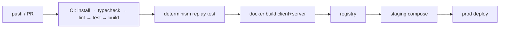

- **Client:** Vite static build → served by Nginx (`Dockerfile.client`), CDN-friendly, hashed assets.
- **Server:** Node.js match host (`Dockerfile.server`), stateless per match, horizontally scalable behind a WS-aware LB.
- **docker-compose** for local full-stack (client + server + optional Redis for match registry later).
- **Cross-origin isolation** headers (`COOP`/`COEP`) set for `SharedArrayBuffer`.
- CI must pass: typecheck (strict) · ESLint · unit + integration · **determinism replay test** · build. Deterministic gate is non-negotiable.

---

## 20. Testing Strategy

- **Unit (Vitest):** every domain rule, component store, system in isolation with fabricated worlds. Fixed-point math and RNG have property tests.
- **Determinism harness:** run a scripted command log twice (and once in Node, once via worker path) → assert identical state hashes at every checkpoint. Core CI gate.
- **System integration:** seed a small world, feed commands, assert emergent outcomes (unit kills target in N ticks; harvester economy loop nets expected credits).
- **Snapshot/serialization round-trip:** save → load → resim → identical hash.
- **Replay round-trip:** record → replay → identical final state.
- **Contract tests** on ports (`Renderer`, `Transport`, `SaveStore`) with mock + real adapters.
- **Presentation:** React Testing Library for HUD; input controller tested with synthetic pointer events → asserted command intents.
- **Performance regression:** benchmark tick time vs entity count; fail if > budget.
- **Coverage target:** ≥ 90% on `engine`, meaningful (not vanity) elsewhere.

---

## 21. Future Scalability

- **Authoritative server + prediction:** swap transport/authority behind existing ports; sim core unchanged.
- **Pathfinding worker pool:** offload batch A*/flow-field builds; results applied on scheduled ticks (still deterministic).
- **Bigger maps:** chunked NavGrid + streamed terrain; hierarchical pathfinding (HPA*).
- **Mod/content pipeline:** all content already JSON+schema; expose a content SDK.
- **WebGPU renderer:** renderer behind a port → add a WebGPU adapter without touching sim.
- **Spectator/casting, ranked ladder, matchmaking service:** additive services around the match host.
- **Rollback netcode option:** determinism already enables rollback if lockstep latency becomes limiting.

---

## 22. Implementation Roadmap

Iterative, one subsystem at a time — each: implement → test → document → next.

| #   | Milestone                     | Deliverable                                                                                                           | Status                                             |
| --- | ----------------------------- | --------------------------------------------------------------------------------------------------------------------- | -------------------------------------------------- |
| 0   | **Scaffold**                  | pnpm workspaces, tsconfig strict, ESLint/Prettier, Vitest, Docker skeleton, empty packages wired                      | ✅ done                                            |
| 1   | **ECS core**                  | World, EntityManager, sparse-set ComponentStore, Query, Scheduler + full tests                                        | ✅ done                                            |
| 2   | Fixed-point math + seeded RNG | `fp`, `Vec2`, `Random` + property tests                                                                               | ✅ done                                            |
| 3   | Simulation loop + snapshots   | fixed-step tick, snapshot publish, determinism harness                                                                | ✅ done                                            |
| 4   | Command bus + basic commands  | Move/Stop/Spawn + command→intent flow                                                                                 | ✅ done                                            |
| 5   | Render bootstrap              | Pixi stage, camera, worker bridge, interpolated draw                                                                  | ✅ done                                            |
| 6   | Movement + pathfinding        | NavGrid, A*, path smoothing, blocked-goal approach, **flow fields**, **formations**                                   | ✅ done                                            |
| 7   | Selection + input             | box/click/ctrl/shift/double-click type-select → commands, HUD selection                                               | ✅ done                                            |
| 8   | Combat + projectiles          | health, weapons, damage, chase/leash, death                                                                           | ✅ done (armor table + abilities: pending)         |
| 9   | Economy + harvester loop      | credits, ore, gather/deposit, per-player economy                                                                      | ✅ done                                            |
| 10  | Base building + production    | building archetypes, footprint→navgrid, drop-off, **build queues + construction time + rally points + cancel/refund** | ✅ done                                            |
| 11  | Energy + tech tree            | power grid per player, **deficit disables defenses**, **tech tree research + production gating**                      | ✅ done                                            |
| 12  | Fog of war                    | vision + team-shared visibility, rendered                                                                             | ✅ done                                            |
| 13  | AI Director                   | economy + production + aggression, difficulty tiers                                                                   | ✅ done (scout/expand/harass refinements: pending) |
| 14  | Save / load / replay          | full state serialization + replay round-trip + desync checksums                                                       | ✅ done                                            |
| 15  | Networking transport          | WS lockstep relay + **client transport + lockstep coordinator (tested) + NetworkClient**                              | ✅ done (headless server sim: pending)             |
| 16  | UI polish, audio, effects     | HUD, contextual orders, **minimap**, **particle explosions**, **synth spatial audio**                                 | ✅ done                                            |
| 17  | Map editor                    | terrain painting, resources, spawns, **local catalog + JSON import/export + validation**                              | ✅ done (triggers/scripted events: pending)        |
| 18  | Playable production           | select production structures, pay unit costs, queue/progress UI, cancel/refund, rally points                          | ✅ done                                            |
| 19  | Match lifecycle               | explicit playing/victory/defeat states, deterministic win conditions, end screen, restart                             | ✅ done                                            |
| 20  | Base construction             | placement preview, footprint validation, costs, build time and power consequences                                     | ✅ done                                            |
| 21  | Maps and scenarios            | load editor maps into matches, deterministic triggers, objectives and scripted events                                 | in progress (map loading done; scripting pending)  |
| 22  | Authoritative multiplayer     | headless server simulation, command ownership validation, periodic checksums and desync handling                      | planned                                            |
| 23  | Tactical AI                   | scouting, expansion, harassment, threat response and deterministic difficulty tuning                                  | planned                                            |
| 24  | Content vertical slice        | two original factions, balanced roster, production-quality visual/audio assets and one representative map             | planned                                            |
| 25  | Release hardening             | performance budgets, end-to-end match tests, accessibility pass and reproducible production deployment                | planned                                            |

---

_End of SDD v1.0. Subsequent PRs implement one milestone per branch, updating this document's status table as they land._
